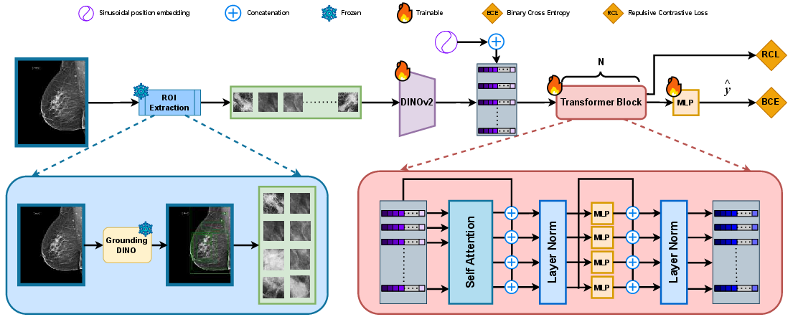

# ATTEND WHAT MATTERS: LEVERAGING VISION FOUNDATIONAL MODELS FOR BREAST CANCER CLASSIFICATION USING MAMMOGRAMS

This repository contains the implementation of a breast cancer classification system using vision transformers and region-of-interest (ROI) based attention mechanisms on mammogram images.

## Architecture



Our approach leverages vision foundation models to process multiple regions of interest (ROIs) from mammogram images. The architecture uses:
- **Multi-ROI Processing**: Extracts and processes top-k regions of interest along with a full-breast anchor
- **Vision Transformer Backbone**: Utilizes pre-trained vision models for robust feature extraction
- **Contrastive Learning**: Employs repulsive contrastive loss to ensure distinct embeddings across different ROIs
- **Attention-Based Pooling**: Aggregates ROI features using learned attention mechanisms for final classification

## Environment Setup

Create a conda environment with Python 3.12 and install dependencies:

```bash
# Create conda environment
conda create -n unibcd python=3.12 -y
conda activate unibcd

# Install requirements
pip install -r requirements.txt
```


## Dataset

This project uses the **VinDr-Mammo** dataset, a large-scale benchmark dataset for computer-aided diagnosis in mammography.

**Dataset Link**: [https://vindr.ai/datasets/mammo](https://vindr.ai/datasets/mammo)

### Dataset Structure

After downloading the dataset:
- **Images**: Store DICOM mammogram images in your designated image directory
- **CSV Files**: Use the CSV files provided in the `csvs/` folder:
  - `train.csv` - Training set annotations
  - `val.csv` - Validation set annotations  
  - `test.csv` - Test set annotations

### Bounding Boxes Format

Bounding box predictions are stored in `.txt` files with the following format:

| Column | Description | Type |
|--------|-------------|------|
| cx | Center X coordinate | float |
| cy | Center Y coordinate | float |
| w | Width of bounding box | float |
| h | Height of bounding box | float |
| score | Confidence score (0-1) | float |

**Example**:
```
484.21457 1252.9696 956.2774 2497.9783 0.8152017
451.5749 1951.7893 888.2998 1049.3607 0.12970464
890.8803 2018.1466 170.31876 185.71185 0.089921385
```

Each line represents one bounding box proposal with center coordinates, dimensions, and confidence score.

<details>
<summary><b>Generating Bounding Boxes with Grounding DINO</b></summary>

To generate bounding box proposals for your mammogram images using Grounding DINO:

### 1. Install Grounding DINO

Ensure you have `nvcc` installed and ```echo $CUDA_HOME```
outputs path to nvcc

```bash
# Clone the Grounding DINO repository
git clone https://github.com/IDEA-Research/GroundingDINO.git
cd GroundingDINO

micromamba create -n gdino python=3.12
pip install setuptools==68.0.0 wheel==0.41.2
pip install torch torchvision
```

Apply the patch inside the GroundingDINO repository:
[assets/gdino.patch](assets/gdino.patch)


```bash
# copy patch into the GroundingDINO repo 

# preview and check
git apply --stat gdino.patch
git apply --check gdino.patch

# apply the patch
git apply gdino.patch

# if git apply fails, try the patch command
# patch -p1 < gdino.patch

# commit the changes
git add -A
git commit -m "Apply gdino.patch"

#install gdino
pip install -e .
```

### 2. Running Inference

Download pre-trained weights
```bash
mkdir weights
cd weights
wget -q https://github.com/IDEA-Research/GroundingDINO/releases/download/v0.1.0-alpha/groundingdino_swint_ogc.pth
cd ..

python3 run.py
```

Edit the `INPUT_FOLDER_PATH` `OUTPUT_FOLDER_PATH` and `CSV_PATH` inside the GroundingDINO/run.py file 


</details>

## Training

Train the model using the `train.py` script:

```bash
python train.py \
    --train_csv csvs/train.csv \
    --train_img_base /path/to/dicom/images/ \
    --train_text_base bounding_boxes/bounding_boxes_train/ \
    --val_csv csvs/val.csv \
    --val_img_base /path/to/dicom/images/ \
    --val_text_base bounding_boxes/bounding_boxes_val/ \
    --batch_size 4 \
    --lr 1e-6 \
    --epochs 100 \
    --topk 5 \
    --contrastive_weight 0.3 \
    --pos_weight 10.0 \
    --pool_mode anchor \
    --out_dir ./outputs \
    --num_workers 8 \
    --patience 5
```

### Key Training Arguments:

- `--train_csv`, `--val_csv`: Path to CSV files containing image paths and labels
- `--train_img_base`, `--val_img_base`: Base directory for DICOM images
- `--train_text_base`, `--val_text_base`: Directory containing bounding box predictions
- `--topk`: Number of ROI proposals to use per image (default: 5)
- `--pool_mode`: Pooling strategy - `anchor` (use full-breast ROI), `attn` (attention pooling), `avg` (average), or `cls` (CLS token)
- `--contrastive_weight`: Weight for repulsive contrastive loss (default: 0.3)
- `--pos_weight`: Positive class weight for handling class imbalance (default: 10.0)
- `--patience`: Early stopping patience epochs (default: 5)
- `--fp16`: Enable mixed precision training
- `--freeze_backbone`: Freeze vision backbone for faster training

Model checkpoints are saved to the output directory after each epoch.

## Evaluation

Evaluate trained models using the `eval.py` script:

### Single Checkpoint Evaluation

```bash
python eval.py \
    --ckpt model_epoch_9.pt \
    --val_csv csvs/test.csv \
    --val_img_base /path/to/dicom/images/ \
    --val_text_base bounding_boxes/bounding_boxes_test/ \
    --batch_size 4 \
    --topk 5 \
    --pool_mode anchor \
    --out_dir ./eval_outputs \
    --num_workers 8
```

### Multiple Checkpoints Evaluation

Evaluate all checkpoints in a folder concurrently:

```bash
python eval.py \
    --ckpt_folder ./outputs/ \
    --val_csv csvs/test.csv \
    --val_img_base /path/to/dicom/images/ \
    --val_text_base bounding_boxes/bounding_boxes_test/ \
    --batch_size 4 \
    --topk 5 \
    --concurrent 4 \
    --out_dir ./eval_outputs
```

### Evaluation Outputs

The evaluation script generates:
- **Metrics**: Accuracy, Precision, Recall, F1-score, ROC-AUC, FPR at various thresholds
- **Predictions**: Raw predictions and targets saved as `.npy` files
- **Attention Maps**: Visualization of attention weights across ROI proposals
- **UMAP Embeddings**: 2D visualization of learned embeddings with k-NN analysis
- **Summary JSON**: Comprehensive metrics saved in `metrics_summary.json`

---

